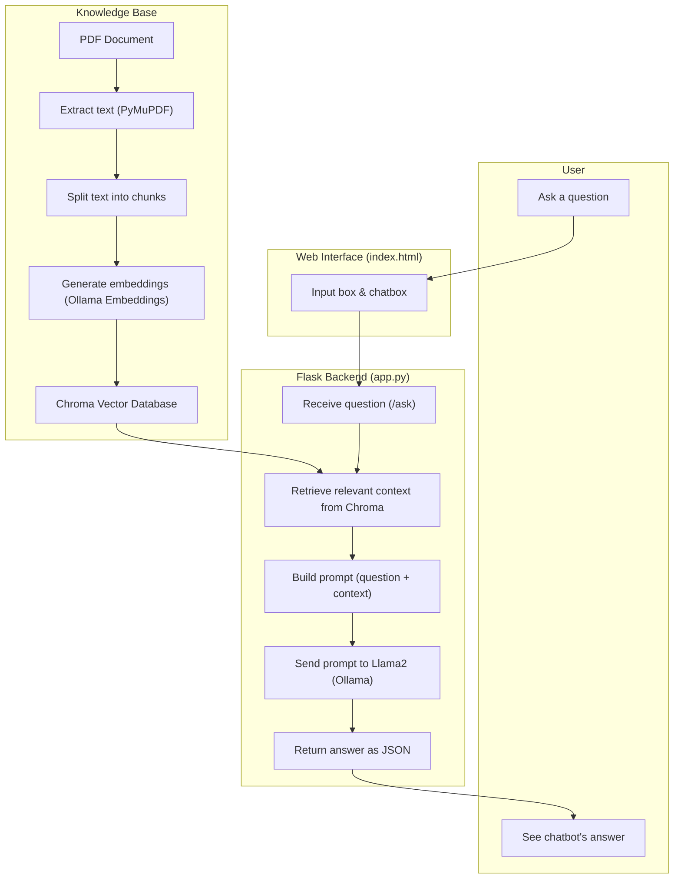

--7th semester project (PMLD)--

Coffee Chatbot is a simple web application that allows users to ask questions about coffee and get instant answers. It combines a backend built with Flask and LangChain with a Llama2 model running on Ollama, and uses a small knowledge base stored in a Chroma database.

## Features
- Ask and answer about coffee (general topics or based on provided documents)
- Upload and process PDF documents to enrich the chatbot's knowledge
- Uses modern open-source tools (Flask, LangChain, Ollama)

## How It Works
### Adding knowledge
- Text is extracted from a PDF file
- The text is split into smaller parts and saved into a Chroma database  

### Chat process
- A user asks a question in the web interface 
- The backend looks up relevant information from the database
- The question and context are combined and sent to the Llama2 model
- The model generates an answer, which is shown back in the chatbox  

## Process Flow

